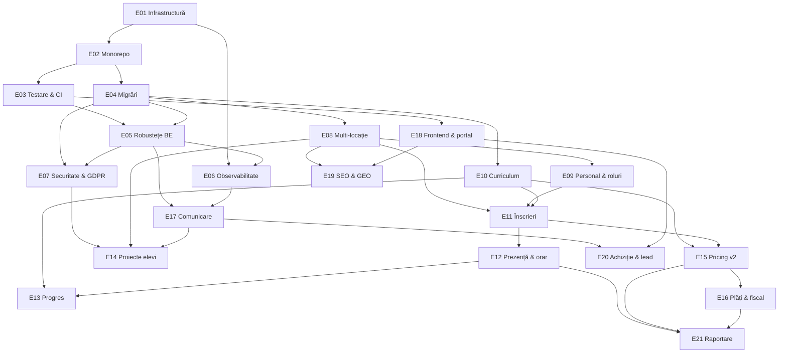

# Epic-uri ITBridge

Harta completă de lucru pentru platformă. Fiecare epic e un fișier separat, pe același șablon:
**Problemă → Rezultat → Scop → Story-uri → Dependențe → Riscuri → Definition of done →
Întrebări deschise**.

Problema din fiecare epic e ancorată în cod real, cu fișier și linie. Nu sunt intenții generice;
sunt lucruri verificate în repo.

## Cum se citește

Cele 21 de epic-uri de mai jos descriu **tot** ce îi trebuie unei platforme de management pentru
o școală de IT cu mai multe locații. Nu sunt un angajament pentru următoarele șase luni — sunt
harta completă, ca să nu descoperim la jumătatea drumului că o decizie luată devreme blochează
ceva ce oricum trebuia făcut.

Pentru primele șase luni realiste, vezi secțiunea [Ordinea recomandată](#ordinea-recomandată).

## Stare curentă

Frontend pe Vercel, funcționând ca prezentare statică. Backend nedeployat nicăieri. Validarea
cererilor nu rulează, deși 22 de DTO-uri au decoratori. Testele nu pornesc — 18 din 18 suite
eșuează la încărcare. Schema se auto-alterează la fiecare boot. Platforma nu are noțiunea de
locație, deși școala are două.

Curățenia de infrastructură din E01 a intrat: aplicația nu mai rulează în Docker, `docker-compose.yml`
e doar Postgres, iar cele trei strategii de deploy moarte au dispărut din repo. Cheia Let's Encrypt
a fost ștearsă din branch, dar rămâne în istoricul git — e compromisă și nu se refolosește.

E02 a intrat și el: monorepo pnpm cu `apps/api`, `apps/web` și `packages/types`, orchestrat cu
Turborepo. `pnpm install && pnpm dev` pornește tot. Contractul API partajat a scos la iveală, la
adoptare, un bug vizibil în producție — coloana „Tip Sesiune" din prezență era goală la fiecare
rând, fiindcă frontend-ul își cheia etichetele pe valori pe care backend-ul nu le trimite.

Detalii în [CLAUDE.md](../../CLAUDE.md), secțiunea „Capcane".

## Tabel

| #                                     | Epic                                              | Pistă      | Depinde de    | Schemă |
| ------------------------------------- | ------------------------------------------------- | ---------- | ------------- | ------ |
| [E01](E01-infrastructura-medii.md)    | Curățenie infrastructură și medii de rulare       | Fundație   | —             | —      |
| [E02](E02-monorepo-tooling.md)        | Monorepo: pnpm, Turborepo și fluxul de dezvoltare | Fundație   | E01           | —      |
| [E03](E03-testare-ci.md)              | Testare și CI                                     | Fundație   | E02           | —      |
| [E04](E04-migrari-date.md)            | Migrări și integritatea datelor                   | Fundație   | E02           | **da** |
| [E05](E05-robustete-backend.md)       | Robustețe backend                                 | Fundație   | E03, E04      | —      |
| [E06](E06-observabilitate-operare.md) | Observabilitate și operare                        | Fundație   | E01, E05      | —      |
| [E07](E07-securitate-gdpr.md)         | Securitate, GDPR și consimțământ                  | Fundație   | E04, E05      | **da** |
| [E08](E08-multi-locatie.md)           | Multi-locație și săli                             | Domeniu    | E04           | **da** |
| [E09](E09-personal-roluri.md)         | Personal, roluri și permisiuni                    | Domeniu    | E08           | **da** |
| [E10](E10-curriculum-module.md)       | Curriculum și catalog de module                   | Domeniu    | E04           | **da** |
| [E11](E11-inscrieri-capacitate.md)    | Înscrieri, grupe și capacitate                    | Operațiuni | E08, E09, E10 | **da** |
| [E12](E12-prezenta-orar.md)           | Prezență, recuperări și orar                      | Operațiuni | E11           | **da** |
| [E13](E13-progres-evaluare.md)        | Progres, evaluare și feedback                     | Operațiuni | E10, E12      | **da** |
| [E14](E14-proiecte-elevi.md)          | Proiectele elevilor                               | Operațiuni | E07, E08, E17 | **da** |
| [E15](E15-pricing-facturare.md)       | Pricing și facturare v2                           | Bani       | E10, E11      | **da** |
| [E16](E16-plati-fiscal.md)            | Plăți online, încasări și conformitate fiscală    | Bani       | E15           | **da** |
| [E17](E17-comunicare-notificari.md)   | Comunicare și notificări                          | Comunicare | E05, E06      | **da** |
| [E18](E18-frontend-portal.md)         | Frontend: design system și portal părinte         | Public     | E03           | —      |
| [E19](E19-seo-geo.md)                 | SEO, GEO și conținut                              | Public     | E08, E18      | —      |
| [E20](E20-achizitie-lead.md)          | Achiziție, lecții de probă și lead management     | Public     | E17, E18      | **da** |
| [E21](E21-raportare-analytics.md)     | Raportare și analytics                            | Business   | E12, E15, E16 | —      |

## Harta dependențelor

## Ordinea recomandată

**Val 1 — fundația de unelte.** E01, E02, E03, E04. Sunt mecanice, se fac într-o săptămână-două
împreună, și fără ele restul se construiește pe nisip. E04 în special: șapte epic-uri schimbă
schema, iar cât timp rulăm cu `synchronize: true` fiecare dintre ele e o ruletă.

**Val 2 — fundația de domeniu.** E05, E08, E10. Multi-locația și modelul de curriculum sunt
schimbări structurale. Făcute după E11 sau E15 înseamnă rescriere, nu adăugare.

**Val 3 — două piste în paralel.** Operațiuni (E09, E11, E12) și public (E18, E19) nu se ating.
Sunt fișiere diferite și obiective diferite, se pot duce simultan.

**Val 4 — bani și livrare.** E15, E16, E17, E14. Aici se schimbă modelul de business, deci
trebuie să existe deja plasa de siguranță din E03.

**Val 5 — creștere și măsurare.** E20, E21, E13.

E06 și E07 se pot strecura oriunde după val 1, și cu cât mai devreme cu atât mai bine.

Primele șase luni, realist: **val 1 complet, val 2 complet, plus E18 și E15.** Restul e an doi.

## Legendă status

Fiecare epic are `Status` în antet: `propus` → `acceptat` → `în lucru` → `livrat`. Nimic nu trece
în `în lucru` fără ca întrebările deschise din fișier să aibă răspuns.

[E01](E01-infrastructura-medii.md) e `în lucru`: S1, S2, S3 și S5 sunt livrate, S4 (deploy pe EC2)
și S6 (curățare de branch-uri) rămân. [E02](E02-monorepo-tooling.md) e `livrat`. Restul sunt
`propus`.

## Decizii deja luate

Consemnate aici ca să nu fie relitigate în fiecare epic. Fiecare e detaliată, cu consecințele ei,
în secțiunea „Decizii luate" a epicului indicat.

### Rulare și infrastructură

| Decizie                              | Detaliu                                                                    | Epic                               |
| ------------------------------------ | -------------------------------------------------------------------------- | ---------------------------------- |
| Fără Docker pentru aplicație         | Nici în dev, nici în producție. Docker doar pentru Postgres local.         | [E01](E01-infrastructura-medii.md) |
| Backend pe AWS EC2                   | Cu PM2. `aws.yml` se rescrie, nu se șterge — cu `pm2 reload` și rollback.  | [E01](E01-infrastructura-medii.md) |
| Postgres pe instanța EC2             | Backup-urile merg în S3. Proba de restaurare devine obligatorie.           | [E04](E04-migrari-date.md)         |
| S3 pentru fișiere, fără chei statice | IAM instance role în loc de `AWS_ACCESS_KEY_ID`.                           | [E07](E07-securitate-gdpr.md)      |
| Frontend pe Vercel                   | Rămâne.                                                                    | [E01](E01-infrastructura-medii.md) |
| pnpm workspaces plus Turborepo       | Lockfile unic. `pnpm dev` pornește ambele; `dev:api` și `dev:web` separat. | [E02](E02-monorepo-tooling.md)     |
| Fără date de producție de păstrat    | Baza se reconstruiește de la zero. Simplifică mult E04, E11 și E12.        | [E04](E04-migrari-date.md)         |

### Model de business

| Decizie                    | Valoare                                                                                         | Epic                               |
| -------------------------- | ----------------------------------------------------------------------------------------------- | ---------------------------------- |
| Unitate de facturare       | Modulul școlar: 6-8 ședințe, ~5 module pe an, delimitate de vacanțe                             | [E10](E10-curriculum-module.md)    |
| Preț                       | **700 lei fix per modul**, indiferent de durată                                                 | [E15](E15-pricing-facturare.md)    |
| Planuri de plată           | Integral, sau două tranșe egale — **două facturi separate**, a doua emisă la mijlocul modulului | [E15](E15-pricing-facturare.md)    |
| Reducere frați             | **−25% de la al doilea copil în jos**; primul plătește întreg                                   | [E15](E15-pricing-facturare.md)    |
| Facturare                  | **SmartBill** e sistemul de evidență fiscală. Platforma calculează, SmartBill emite.            | [E16](E16-plati-fiscal.md)         |
| Abandon la mijloc de modul | Fără returnare; a doua factură nu se mai emite                                                  | [E15](E15-pricing-facturare.md)    |
| Recuperări                 | 2 per modul, doar absențe anunțate cu min. 3 ore înainte. Configurabil.                         | [E12](E12-prezenta-orar.md)        |
| Lecția de probă            | Gratuită                                                                                        | [E11](E11-inscrieri-capacitate.md) |

Două consecințe care nu sunt evidente din tabel:

**Calendarul școlar devine date de bază.** Fiindcă vacanțele delimitează modulele, iar modulul e
unitatea de facturare, calendarul determină ce se facturează și când. [E10](E10-curriculum-module.md)
și [E12](E12-prezenta-orar.md) se ating aici și se implementează în aceeași perioadă.

**Recuperarea nu e datorie contractuală.** Cu preț fix pe modul, părintele cumpără participarea la
un modul, nu un număr garantat de ședințe. Recuperarea rămâne instrument de retenție, nu obligație —
iar formularea din factură și din termeni trebuie să reflecte asta.

**Platforma nu mai emite facturi.** Cu SmartBill ca sistem de evidență fiscală, ies din scop
numerotarea, TVA-ul, e-Factura și PDF-ul de factură. `it-bridge-backend/src/modules/invoice/pdf.service.ts` rămâne doar pentru documente
nefiscale — certificatele din [E13](E13-progres-evaluare.md). În schimb intră în scop două lucruri
noi: sincronizarea între două sisteme cu stări proprii, și o coadă temperată la **3 apeluri pe
secundă**, limita API-ului SmartBill. Premisa comercială — abonament **Facturare Platinum** — se
verifică înainte de orice cod.

### Acces și produs

| Decizie                                         | Detaliu                                                         | Epic                          |
| ----------------------------------------------- | --------------------------------------------------------------- | ----------------------------- |
| Profesorul vede contactul complet al părinților | Doar grupele proprii, doar pe durata alocării, cu audit log     | [E09](E09-personal-roluri.md) |
| Logo-ul există                                  | 500×500 PNG. Necesar un vectorial pentru tipar și afișare mare. | [E18](E18-frontend-portal.md) |
| Uploader de proiecte                            | PWA conștientă de context, nu script de click dreapta           | [E14](E14-proiecte-elevi.md)  |
