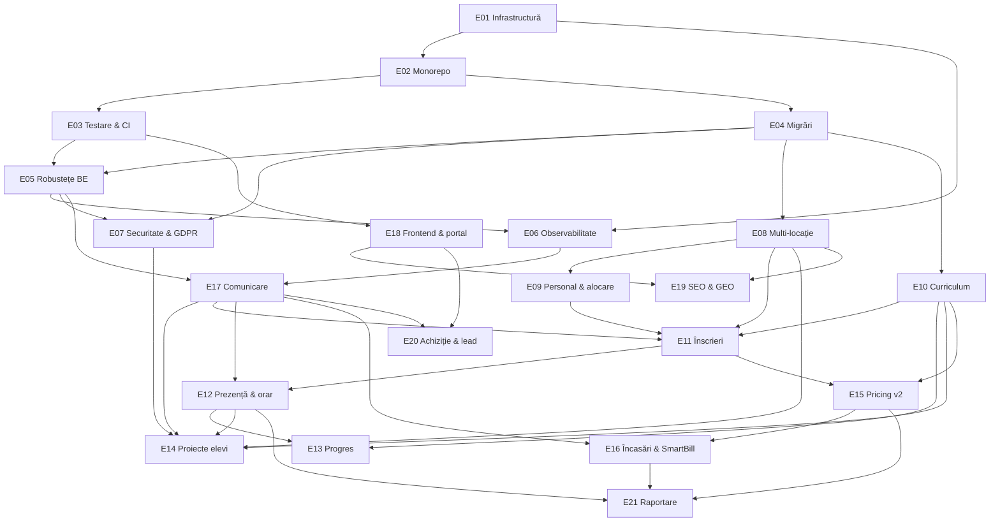

# Epic-uri ITBridge

Harta completă de lucru pentru platformă. Fiecare epic e un fișier separat, pe același șablon:
**Problemă → Rezultat → Scop → Story-uri → Dependențe → Riscuri → Definition of done →
Întrebări deschise**.

Problema din fiecare epic e ancorată în cod real, cu fișier și linie. Nu sunt intenții generice;
sunt lucruri verificate în repo.

## Cum se citește

Cele 21 de epic-uri de mai jos descriu **tot** ce îi trebuie unei platforme de management pentru
o școală de IT cu mai multe locații. Nu sunt un angajament pentru următoarele șase luni — sunt
harta completă, ca să nu descoperim la jumătatea drumului că o decizie luată devreme blochează
ceva ce oricum trebuia făcut.

Pentru primele șase luni realiste, vezi secțiunea [Ordinea recomandată](#ordinea-recomandată).

## Stare curentă

Frontend pe Vercel, funcționând ca prezentare statică. Backend nedeployat nicăieri — de aceea stă pe
loc [E01](E01-infrastructura-medii.md) S4, care așteaptă instanța EC2, și odată cu el tot ce are
nevoie de un API care rulează: [E18](E18-frontend-portal.md) S4 și S5, backupul din
[E04](E04-migrari-date.md) S4, [E14](E14-proiecte-elevi.md) S3b (ffmpeg pe host) și S6 (vitrina
publică). Cinci story-uri din trei epicuri, toate în așteptarea aceleiași instanțe — de aceea S4 din
E01 nu e o sarcină de infrastructură printre altele, ci pragul peste care nu trece nimic altceva.
Locația e dimensiune de primă clasă din [E08](E08-multi-locatie.md).

Curățenia de infrastructură din E01 a intrat: aplicația nu mai rulează în Docker, `docker-compose.yml`
e doar Postgres, iar cele trei strategii de deploy moarte au dispărut din repo. Cheia Let's Encrypt
a fost ștearsă din branch, dar rămâne în istoricul git — e compromisă și nu se refolosește.

E02 a intrat și el: monorepo pnpm cu `apps/api`, `apps/web` și `packages/types`, orchestrat cu
Turborepo. `pnpm install && pnpm dev` pornește tot.

E03 a adus plasa de siguranță: 345 de teste, de la unitare pe logica de facturare până la
integrare prin HTTP pe Postgres, plus o matrice de autorizare care se generează singură din
metadatele controllerelor. CI rulează pe fiecare PR.

Testele au scos la iveală trei bug-uri, documentate ca `it.failing` în loc să fie cimentate. Două
sunt reparate în E04, cu testele întoarse în teste de regresie: restrângerea dublată din
`findPayments` și crearea unui al doilea profil fără date de contact, care întorcea 409 și bloca
fluxul de admin. Al treilea — calculul de preț la trei copii — rămâne, fiindcă prețul corect se
stabilește în [E15](E15-pricing-facturare.md).

E05 a adus robustețea: validarea chiar rulează și a scos la iveală trei DTO-uri greșite, erorile au
o formă unică fără SQL în ele, aplicația refuză să pornească prost configurată, refresh tokenurile
sunt revocabile cu logout real și detectare de furt, iar `/health` și limitarea de rată există.

E04 a oprit `synchronize: true`. Schema evoluează acum prin migrări, iar CI verifică pe fiecare PR
că entitățile n-au divergat de ele. `pnpm seed` reconstruiește o bază locală plauzibilă în câteva
secunde.

E08 a adus locația: `Location` și `Room` există, fiecare grupă se ține într-o sală, iar
constrângerea care interzicea două grupe la aceeași oră _în toată școala_ a fost înlocuită cu una pe
sală. Zona de admin are un selector de locație, iar o a treia adresă se adaugă din interfață.

Tot din E08, grupa a devenit descriptibilă: are nume, sală — deci implicit locație — și `capacity`
`NOT NULL`, validată să nu depășească capacitatea sălii, iar `minAge`/`maxAge` sunt acum `int`, nu
`decimal` (`apps/api/src/entities/group.entity.ts`). Consecința pentru epicurile din aval:
[E11](E11-inscrieri-capacitate.md) nu mai trebuie să inventeze capacitatea, doar să o aplice la
înscriere — azi nimic nu o verifică. Ce a rămas din E08 sunt nivelul din catalog
([E10](E10-curriculum-module.md)) și profesorul principal ([E09](E09-personal-roluri.md)), deci
epicul stă până pornește unul dintre ele.

Cele două au luat între timp drumuri opuse, amândouă din decizii, nu din cod.
[E09](E09-personal-roluri.md) s-a micșorat și a rămas: nu se implementează rol de profesor, dar
`Staff` și alocarea profesorului pe grupă rămân — exact bucata de care are nevoie E08 S3.
[E10](E10-curriculum-module.md), în schimb, **a ieșit din MVP**, respins de patron — motivul e la
[Ordinea recomandată](#ordinea-recomandată). Consecința pentru E08 S3 e că nivelul din catalog nu
mai vine de nicăieri: singurul lucru care mai poate închide story-ul e profesorul principal din E09,
iar `minAge`/`maxAge` rămân câmpuri, nu o consecință a nivelului.

E12 a început, și a început cu partea de care atârnă restul: **ședința e acum un rând în tabel.**
`ClassSession` (`class_sessions`) ține grupa, data, intervalul, sala și starea
`scheduled | held | cancelled`, se generează idempotent din orarul grupei pe un orizont rulant de
opt săptămâni, iar prezența se leagă de ea — unicitatea a trecut de la `(copil, dată, oră)` la
`(copil, ședință)`. Migrarea a construit ședințele din combinațiile deja existente în `attendances`,
fără pierdere de date. Nu există legătură la modul sau lecție: [E10](E10-curriculum-module.md) a
ieșit din MVP, vezi [Ordinea recomandată](#ordinea-recomandată).

Odată cu ea a intrat și prima bucată din [E17](E17-comunicare-notificari.md), fiindcă jobul cerut
explicit de patron nu avea pe unde pleca: la 10:00, ședințele de ieri rămase `scheduled` și fără
nicio prezență se adună într-un singur email către adresa școlii, iar în zilele în care totul e
marcat nu pleacă nimic. `apps/api` nu putea trimite nimic până atunci — Resend era doar în ruta
Nitro a formularului de contact, care rulează pe Vercel și nu vede baza de date. Deci s-au construit
`MailService` și tabelul `outbox`, cât a cerut jobul; **scheduler-ul care golește coada nu rulează
în producție până la [E01](E01-infrastructura-medii.md) S4.**

Tot aici s-au reparat două bug-uri mai vechi decât branch-ul, amândouă în calendarul părintelui.
Prezența stătea într-un cookie: măsurat pe API-ul real, șapte ședințe înseamnă 11,7 KB de JSON și
18,6 KB URI-encoded, față de limita de ~4 KB, deci browserul arunca tăcut cookie-ul după vreo
ședință și calendarul se randa gol — se citea ca „copilul n-a venit niciodată". Iar culorile se
ghiceau din `Group.weekday`: o zi din trecut care se potrivea cu ziua grupei și nu avea înregistrare
devenea roșu, „absent", inclusiv în luni în care nu existase nicio ședință. Acum se citesc ședințele,
iar „nemarcat" are culoare proprie și o legendă care spune că nu înseamnă absență.

Ce nu a intrat din E12: calendarul de vacanțe, absențele anunțate, recuperările, ecranul de anulare
și de mutare — anularea individuală există doar prin API, fără ecran și fără notificare —, marcarea
pe telefon și notificările către părinți. Ultimele cer [E17](E17-comunicare-notificari.md) întreg.

Detalii în [CLAUDE.md](../../CLAUDE.md), secțiunea „Capcane”.

## Tabel

| #                                     | Epic                                              | Pistă      | Depinde de              | Schemă |
| ------------------------------------- | ------------------------------------------------- | ---------- | ----------------------- | ------ |
| [E01](E01-infrastructura-medii.md)    | Curățenie infrastructură și medii de rulare       | Fundație   | —                       | —      |
| [E02](E02-monorepo-tooling.md)        | Monorepo: pnpm, Turborepo și fluxul de dezvoltare | Fundație   | E01                     | —      |
| [E03](E03-testare-ci.md)              | Testare și CI                                     | Fundație   | E02                     | —      |
| [E04](E04-migrari-date.md)            | Migrări și integritatea datelor                   | Fundație   | E02                     | **da** |
| [E05](E05-robustete-backend.md)       | Robustețe backend                                 | Fundație   | E03, E04                | —      |
| [E06](E06-observabilitate-operare.md) | Observabilitate și operare                        | Fundație   | E01, E05                | —      |
| [E07](E07-securitate-gdpr.md)         | Securitate, GDPR și consimțământ                  | Fundație   | E04, E05                | **da** |
| [E08](E08-multi-locatie.md)           | Multi-locație și săli                             | Domeniu    | E04                     | **da** |
| [E09](E09-personal-roluri.md)         | Personal și alocare                               | Domeniu    | E08                     | **da** |
| [E10](E10-curriculum-module.md)       | Curriculum și catalog de module                   | Domeniu    | E04                     | **da** |
| [E11](E11-inscrieri-capacitate.md)    | Înscrieri, grupe și capacitate                    | Operațiuni | E08, E09, E10           | **da** |
| [E12](E12-prezenta-orar.md)           | Prezență, recuperări și orar                      | Operațiuni | E11                     | **da** |
| [E13](E13-progres-evaluare.md)        | Progres, evaluare și feedback                     | Operațiuni | E10, E12                | **da** |
| [E14](E14-proiecte-elevi.md)          | Proiectele elevilor                               | Operațiuni | E07, E08, E10, E12, E17 | **da** |
| [E15](E15-pricing-facturare.md)       | Pricing și facturare v2                           | Bani       | E10, E11                | **da** |
| [E16](E16-plati-fiscal.md)            | Încasări și facturare prin SmartBill              | Bani       | E15                     | **da** |
| [E17](E17-comunicare-notificari.md)   | Comunicare și notificări                          | Comunicare | E05, E06                | **da** |
| [E18](E18-frontend-portal.md)         | Frontend: design system și portal părinte         | Public     | E03                     | —      |
| [E19](E19-seo-geo.md)                 | SEO, GEO și conținut                              | Public     | E08, E18                | —      |
| [E20](E20-achizitie-lead.md)          | Achiziție, lecții de probă și lead management     | Public     | E17, E18                | **da** |
| [E21](E21-raportare-analytics.md)     | Raportare și analytics                            | Business   | E12, E15, E16           | —      |

## Harta dependențelor

Muchiile care pleacă din E17 către E11, E12 și E16 sunt mai slabe decât restul și de aceea nu apar
în coloana „Depinde de” din tabel: epicurile alea se pot construi și livra fără canal de
comunicare, dar câteva criterii de acceptanță din ele — locul eliberat care anunță lista de
așteptare, anularea unei ședințe, confirmarea de plată și mementoul de restanță — nu se pot bifa
până nu există E17. Le desenăm ca să nu fie descoperite ca surpriză la sfârșitul lui E11 — de
aceea [Ordinea recomandată](#ordinea-recomandată) urcă E17 S1–S3 în val 3, lângă E11 și E12.

Ce pleacă din **E09** nu mai sunt permisiuni, ci entitatea `Staff` și alocarea profesorului pe
grupă — decizia că nu există rol de profesor a schimbat conținutul muchiilor, nu doar grosimea lor.
Iar consecința diferă pe fiecare direcție, deci nu se poate spune într-o propoziție pentru
amândouă. [E11](E11-inscrieri-capacitate.md) **păstrează dependența, subțiată**: îi trebuie
profesorul pe grupă (E09 S4) și disponibilitatea (S6) ca să propună o grupă pentru un copil nou,
dar nu îi mai trebuie niciun rol. [E14](E14-proiecte-elevi.md) **nu mai depinde deloc**: aștepta
rolul de profesor pentru autorul încărcării, iar în fluxul nou încărcarea vine de la un agent local
și trimiterea o apasă un admin — un cont care există deja. De aceea E09 a ieșit din rândul lui E14
în tabel și muchia `E09 --> E14` nu mai e desenată. Sursa e [E09](E09-personal-roluri.md),
secțiunea „Ce blochează, de fapt”.

Graful nu poate desena tot ce scrie în antetul lui E09. Acolo scrie „Blochează: **E08 S3**” — o
dependență la nivel de story, nu de epic, iar tabelul și graful nu au unde să o pună: în desen apare
doar `E08 --> E09`, care sugerează o singură direcție. Relația e circulară și se desface într-o
singură ordine — E08 S1–S5 (livrate) → E09 S1 → E09 S4 → E08 S3 închis — explicată în
[E09](E09-personal-roluri.md), secțiunea „Dependențe”.

## Ordinea recomandată

**Val 1 — fundația de unelte.** E01, E02, E03, E04. Sunt mecanice, se fac într-o săptămână-două
împreună, și fără ele restul se construiește pe nisip. E04 în special: șapte epic-uri schimbă
schema, iar cât timp rulăm cu `synchronize: true` fiecare dintre ele e o ruletă.

**Val 2 — fundația de domeniu.** E05 și E08. Multi-locația e o schimbare structurală: făcută după
E11 sau E15 înseamnă rescriere, nu adăugare. E05 e livrat, E08 e în lucru.

**[E10](E10-curriculum-module.md) a ieșit din val, respins de patron ca ne-MVP.** Rândurile de mai
sus spuneau până acum că e piesa care rămâne de făcut în valul 2 și că „nu mai e blocat" — nu mai e
adevărat, iar epicul se citește cu asta în minte. Motivul e o neînțelegere de cuvânt, nu o
schimbare de prioritate: prin „curriculum" patronul a înțeles **programa publicată părinților** —
ce se învață, ședință cu ședință, ca material de arătat afară —, iar aia nu e MVP. Ce propunea
epicul, catalogul de module ca structură internă, nu se sprijină nici el pe realitatea de azi:
**unitatea de facturare nu e modulul, ci luna.** Codul facturează `monthIssued` de forma `'YYYY-MM'`,
350 de lei pentru un copil și 250 de fiecare la doi
(`apps/api/src/modules/invoice/invoice.service.ts`), și asta rămâne.

Consecința pentru restul hărții, ca să nu fie descoperită mai târziu: rândurile „unitate de
facturare" și „preț" din [Decizii deja luate](#decizii-deja-luate) — modulul școlar, 700 de lei fix —
descriu o **țintă**, nu practica de azi, iar tot ce derivă din ele în
[E15](E15-pricing-facturare.md) (pro-rata pe ședințele rămase, a doua tranșă la mijlocul modulului)
așteaptă aceeași discuție. Nu se șterg de aici: sunt decizii luate cu patronul, doar că despre un
model care nu a intrat încă. [E13](E13-progres-evaluare.md) și [E14](E14-proiecte-elevi.md), care
depind de E10, rămân unde sunt. Iar E08 S3 nu-și mai primește nivelul din catalog — vezi
[Stare curentă](#stare-curentă).

**Val 3 — două piste în paralel, plus canalul.** Operațiuni (E09, E11, E12) și public (E18, E19)
nu se ating: sunt fișiere diferite și obiective diferite, se pot duce simultan. E09 s-a micșorat:
fără rol de profesor, rămân `Staff`, alocarea pe grupă și disponibilitatea. Aici intră și
[E17](E17-comunicare-notificari.md) **S1–S3** — furnizorul, șabloanele și coada — nu tot epicul.
Motivul e cel din nota de sub graf: fără canal, [E11](E11-inscrieri-capacitate.md) S2 se termină cu o
listă de așteptare care nu anunță pe nimeni, iar [E12](E12-prezenta-orar.md) S5 și S7 rămân fără
anunțul de anulare și fără cel de absență. E17 depinde doar de [E05](E05-robustete-backend.md), care
e livrat, și de [E06](E06-observabilitate-operare.md), care oricum se strecoară devreme — deci nimic
nu-l ține în val 4.

Ordinea asta s-a rupt deja, și nu în rău: E12 S1 a intrat înaintea lui E11, iar odată cu el bucăți
din E17 S1 și S3 — vezi [Stare curentă](#stare-curentă). Ședința ca entitate nu avea nevoie de
înscrieri ca să fie corectă, iar jobul zilnic a tras canalul după el. Ce rămâne din valul 3 e
neatins: E09, E11, restul lui E12, E18 S4–S5, E19, și S2 din E17.

Varianta cealaltă e legitimă: E11 și E12 se pot livra fără partea de notificare. Atunci însă se
scrie de la început că acele criterii de acceptanță rămân deschise până în val 4, ca revenirea la
ele să fie planificată, nu descoperită.

Un lucru rămâne de val 4 oricum: scheduler-ul din E17 S3 nu are unde să ruleze continuu până nu
există instanța din [E01](E01-infrastructura-medii.md) S4. Coada se construiește și se testează
înainte; pornirea ei permanentă vine odată cu deploy-ul.

**Val 4 — bani și livrare.** E15, E16, restul lui E17 (S4–S9) și E14. Aici se schimbă modelul de
business, deci trebuie să existe deja plasa de siguranță din E03. [E16](E16-plati-fiscal.md) S6 și
S7 — confirmarea de plată și mementoul de restanță — cer același canal, dar sunt în același val cu
el, deci nu produc decalajul care apare la E11 și E12.

**Val 5 — creștere și măsurare.** E20, E21, E13.

E06 și E07 se pot strecura oriunde după val 1, și cu cât mai devreme cu atât mai bine.

Primele șase luni, realist: **val 1 complet, val 2 complet, plus E18.** E15 era și el pe
listă și rămâne posibil, dar nu în forma din tabelul de decizii: fără E10, ce se poate face acum e
reparat calculul lunar de azi — gaura de la trei copii și în jos —, nu trecerea la facturare pe
modul. Restul e an doi.

## Legendă status

Fiecare epic are `Status` în antet: `propus` → `acceptat` → `în lucru` → `livrat`. Nimic nu trece
în `în lucru` fără ca întrebările deschise din fișier să aibă răspuns.

[E02](E02-monorepo-tooling.md) și [E03](E03-testare-ci.md) sunt `livrate` — la E03, cu o singură
rezervă: branch protection pe `main` se activează din Settings, nu din repo.

[E05](E05-robustete-backend.md) e `livrat`.

[E08](E08-multi-locatie.md) e `în lucru`, cu S1, S2, S4 și S5 livrate și S3 parțial: grupa are nume,
sală, locație și capacitate, dar nu are încă nivel din catalog ([E10](E10-curriculum-module.md)) și
nici profesor principal ([E09](E09-personal-roluri.md)) — iar cu E10 în afara MVP-ului, singurul
dintre cele două care mai poate veni e al doilea. Facturile și plățile nu respectă selectorul
de locație, intenționat — sunt legate de părinte, iar un părinte poate avea copii la ambele adrese.
Sălile au 10 locuri la ambele locații — capacitatea, numele și starea fiecărei săli se editează din
`/admin/locations`, fără migrare. Întrebarea „câte săli are fiecare locație" s-a închis cu **una**,
exact ce presupune migrarea; 10 locuri și o sală sunt de acum decizie, nu presupunere, iar a doua
sală se adaugă din aceeași pagină în ziua în care apare.

[E12](E12-prezenta-orar.md) e `în lucru`, cu S1 livrat într-o formă redusă: ședința e o entitate,
prezența se leagă de ea, iar jobul zilnic despre prezența nemarcată pune mesajul în coadă. Fără
legătură la modul sau lecție, fiindcă [E10](E10-curriculum-module.md) a ieșit din MVP. Restul —
vacanțe (S2), absențe anunțate (S3), recuperări (S4), anulări și mutări cu ecran și notificare (S5),
marcarea pe telefon (S6), notificările către părinți (S7) — e neînceput. Anularea cu notificare din
S5 și tot S7 cer [E17](E17-comunicare-notificari.md) întreg, iar restul e în afara tăieturii de MVP
agreate cu patronul.

[E17](E17-comunicare-notificari.md) e `în lucru`, dar numai cât a cerut jobul de mai sus. Din S1
există `MailService` în `apps/api`, cu cheia și expeditorul lui, separate de ale formularului
public; din S3 există tabelul `outbox`, scrierea în tranzacția apelantului și scheduler-ul cu
`FOR UPDATE SKIP LOCKED` și pauză crescătoare. **Scheduler-ul nu rulează în producție până la
[E01](E01-infrastructura-medii.md) S4** — nu există instanța și nici fișierul de ecosistem care să-l
fixeze pe una singură. Nu există șabloane (S2), preferințe și dezabonare (S4), evidența pe care o
citește un admin (S5), rezumate (S6), anunțuri (S7) și trimitere pe grupă (S8). Singurul destinatar
de până acum e adresa școlii: **niciun mesaj nu a plecat încă spre un părinte.**

[E01](E01-infrastructura-medii.md) și [E04](E04-migrari-date.md) sunt `în lucru`, amândouă blocate
în același punct: **nu există instanța EC2.** La E01 rămâne S4 (deploy) — S6, curățarea de
branch-uri, e făcută. La E04, S2 e livrat parțial — comenzile și garda de CI există, cablarea în
deploy nu — iar S4 (backup) și S5 (retenție) așteaptă, primul instanța, al doilea răspunsul
contabilului despre cât se păstrează facturile.

[E18](E18-frontend-portal.md) și [E19](E19-seo-geo.md) sunt `în lucru`, livrate amândouă pe partea
publică și oprite amândouă în același punct:

- La **E18** sunt gata S1 (sistemul de design) și S3 (cele șapte pagini publice); S2 e parțial —
  imaginile sunt sub 200KB, dar `@nuxt/image` tot nu e instalat. Rămân S4 (portalul părintelui) și
  S5 (zona de admin), **amândouă blocate de faptul că backend-ul nu rulează nicăieri**: paginile de
  după autentificare nu sunt cablate la un API și nu se pot nici testa, nici arăta. Plus S6
  (verificarea de accesibilitate în CI) și S7 (interfața profesorului — care, fără rol separat, e o
  vedere din zona de admin, nu o zonă a ei).
- La **E19** sunt gata S1, S2, S3 și S7. S4 așteaptă [E10](E10-curriculum-module.md), S5 se face
  odată cu S2 din E18, S6 e blocat de „cine scrie conținutul", iar S8 cere domeniul live.
- Lucrul cel mai valoros rămas în E19 **nu e cod**: două profiluri Google Business verificate, unul
  per adresă. Pentru căutările locale contează mai mult decât orice a rămas în repo.

Deci ordinea firească e [E01](E01-infrastructura-medii.md) S4 înaintea lui E18 S4 — un portal fără
API nu se poate termina.

[E10](E10-curriculum-module.md) rămâne `propus` și **iese din MVP**, respins de patron. Nu e anulat
ca E22 de mai jos și fișierul rămâne unde e — decizia e despre moment, nu despre scop —, dar nu mai
are val. Motivul, pe larg, la [Ordinea recomandată](#ordinea-recomandată): prin „curriculum"
patronul a înțeles programa publicată părinților, care nu e MVP, iar facturarea pe modul nu e
realitatea de azi.

[E09](E09-personal-roluri.md) rămâne `propus` și **s-a micșorat**: rolurile `TEACHER` și
`LOCATION_MANAGER` nu se implementează acum, deci cad și restrângerea pe locație, și dependența de
jurnalul de audit din [E07](E07-securitate-gdpr.md). Rămân `Staff` și alocarea profesorului pe grupă,
utile independent de roluri — și cerute de [E08](E08-multi-locatie.md) S3.

Restul sunt `propus`.

**E22 · Siguranța copilului e anulat**, iar fișierul lui e șters din `docs/epics/`. Motivul e de
scop, nu de prioritate: școala nu ține fișe medicale și nu vrea să înceapă. Datele de sănătate,
notele de incident și persoanele autorizate la preluare ies complet din platformă, explicit, ca să
nu fie repropuse la următoarea rundă de planificare. Singurul lucru păstrat e **contactul de
urgență** — nu e dată de sănătate și costă un câmp — iar el a trecut în datele obligatorii de
înscriere din [E11](E11-inscrieri-capacitate.md), lângă restul datelor cerute la înregistrare.

## Decizii deja luate

Consemnate aici ca să nu fie relitigate în fiecare epic. Fiecare e detaliată, cu consecințele ei,
în secțiunea „Decizii luate” a epicului indicat.

### Rulare și infrastructură

| Decizie                              | Detaliu                                                                                                                                       | Epic                                |
| ------------------------------------ | --------------------------------------------------------------------------------------------------------------------------------------------- | ----------------------------------- |
| Fără Docker pentru aplicație         | Nici în dev, nici în producție. Docker doar pentru Postgres local.                                                                            | [E01](E01-infrastructura-medii.md)  |
| Backend pe AWS EC2                   | Cu PM2. `aws.yml` se rescrie, nu se șterge — cu `pm2 reload` și rollback.                                                                     | [E01](E01-infrastructura-medii.md)  |
| Postgres pe instanța EC2             | Backup-urile merg în S3. Proba de restaurare devine obligatorie.                                                                              | [E04](E04-migrari-date.md)          |
| S3 pentru fișiere, fără chei statice | IAM instance role în loc de `AWS_ACCESS_KEY_ID`.                                                                                              | [E07](E07-securitate-gdpr.md)       |
| Frontend pe Vercel                   | Rămâne.                                                                                                                                       | [E01](E01-infrastructura-medii.md)  |
| pnpm workspaces plus Turborepo       | Lockfile unic. `pnpm dev` pornește ambele; `dev:api` și `dev:web` separat.                                                                    | [E02](E02-monorepo-tooling.md)      |
| Fără date de producție de păstrat    | Baza se reconstruiește de la zero. Simplifică mult E04, E11 și E12.                                                                           | [E04](E04-migrari-date.md)          |
| Joburi de fundal                     | Tabel outbox în Postgres, cu scheduler în procesul API. Fără Redis, fără BullMQ. Construit, dar fără unde să ruleze continuu până la E01 S4.  | [E17](E17-comunicare-notificari.md) |
| O sală per locație, 10 locuri        | Valoare implicită, nu regulă: numărul de locuri, numele și starea fiecărei săli se editează din `/admin/locations`, fără migrare și fără cod. | [E08](E08-multi-locatie.md)         |

### Model de business

**Fiecare rând care spune „modul" descrie o țintă, nu practica de azi.** Unitatea de facturare,
prețul de 700 de lei, tranșele, pro-rata la înscrierea la mijloc, abandonul la mijloc și cele două
recuperări per modul au fost decise cu patronul, dar se sprijină toate pe
[E10](E10-curriculum-module.md), care a ieșit din MVP — vezi
[Ordinea recomandată](#ordinea-recomandată). Ce facturează codul azi e luna: `monthIssued` de forma
`'YYYY-MM'`, 350 de lei pentru un copil și 250 de fiecare la doi
(`apps/api/src/modules/invoice/invoice.service.ts`), deci nici reducerea de frați nu are azi forma
din tabel. Rândurile rămân aici fiindcă sunt decizii, nu propuneri; ce s-a schimbat e când intră.

| Decizie                      | Valoare                                                                                                        | Epic                               |
| ---------------------------- | -------------------------------------------------------------------------------------------------------------- | ---------------------------------- |
| Unitate de facturare         | Modulul școlar: 6-8 ședințe, ~5 module pe an, delimitate de vacanțe                                            | [E10](E10-curriculum-module.md)    |
| Preț                         | **700 lei fix per modul**, indiferent de durată                                                                | [E15](E15-pricing-facturare.md)    |
| Planuri de plată             | Integral, sau două tranșe egale — **două facturi separate**, a doua emisă la mijlocul modulului                | [E15](E15-pricing-facturare.md)    |
| Reducere frați               | **−25% de la al doilea copil în jos**; primul plătește întreg                                                  | [E15](E15-pricing-facturare.md)    |
| Facturare                    | **SmartBill** e sistemul de evidență fiscală. Platforma calculează, SmartBill emite.                           | [E16](E16-plati-fiscal.md)         |
| Abandon la mijloc de modul   | Fără returnare; a doua factură nu se mai emite                                                                 | [E15](E15-pricing-facturare.md)    |
| Înscriere la mijloc de modul | **Pro-rata pe ședințele rămase din modul**, numărate din calendar la data înscrierii, nu din prezența efectivă | [E15](E15-pricing-facturare.md)    |
| Recuperări                   | 2 per modul, doar absențe anunțate cu min. 3 ore înainte. Configurabil.                                        | [E12](E12-prezenta-orar.md)        |
| Lecția de probă              | Gratuită                                                                                                       | [E11](E11-inscrieri-capacitate.md) |
| Locul la lecția de probă     | **Ocupă unul din cele 10 locuri ale grupei.** O grupă plină nu primește copii la probă                         | [E11](E11-inscrieri-capacitate.md) |
| Înscriere                    | **Nu e self-service.** Contul de părinte se aprobă de un admin, iar copilul e înscris în grupă de admin.       | [E11](E11-inscrieri-capacitate.md) |
| Contract                     | Se semnează fizic. Platforma reține doar că există, cu data.                                                   | [E07](E07-securitate-gdpr.md)      |
| Încasare                     | **Transfer bancar sau numerar**, cum alege părintele. Plata cu cardul în portal e amânată, nu în scop          | [E16](E16-plati-fiscal.md)         |
| Date pentru SmartBill        | **Nume și adresă. Fără CNP.**                                                                                  | [E16](E16-plati-fiscal.md)         |

**Excepția de 14 zile a dispărut din rândul de abandon fiindcă nu mai există contract încheiat la
distanță:** înscrierea nu e self-service, contul de părinte îl aprobă un admin, iar contractul se
semnează fizic, la sediu. OUG 34/2014 nu se aplică unui contract semnat față în față, deci „fără
returnare” redevine ce era — o politică comercială obișnuită, apărabilă. Se repune în discuție în
ziua în care apare înscriere online sau plată fără contract pe hârtie; momentul de urmărit e plata
cu cardul în portal din [E16](E16-plati-fiscal.md) — **azi amânată explicit**, fiindcă încasarea se
face prin transfer bancar sau numerar, pe baza facturii date părintelui.

Câteva consecințe care nu sunt evidente din tabel:

**Calendarul școlar devine date de bază.** Fiindcă vacanțele delimitează modulele, iar modulul e
unitatea de facturare, calendarul determină ce se facturează și când. [E10](E10-curriculum-module.md)
și [E12](E12-prezenta-orar.md) se ating aici și se implementează în aceeași perioadă.

**Pro-rata se numără din calendar, nu din catalog.** Ședințele rămase din modul se numără o singură
dată, la data înscrierii, pe calendarul modulului din [E10](E10-curriculum-module.md) — nu pe
prezența înregistrată ulterior. Motivul e practic: dacă baza de calcul ar fi prezența efectivă,
factura n-ar putea fi emisă decât după ce se termină modulul, adică după ce s-a consumat tot ce se
facturează. Absențele de după înscriere nu scad suma; ele se rezolvă prin recuperările din
[E12](E12-prezenta-orar.md). Diferența nu e de formulare: la un modul de 6 ședințe în care copilul
mai prinde 2, regula dă 233 de lei, iar o citire pe prezență ar da alt număr. Exemplele lucrate sunt
în [E15](E15-pricing-facturare.md) S8, care e locul canonic al regulii.

**Pro-rata face ca o ședință să nu valoreze la fel peste tot.** Prețul rămâne 700 lei fix pe modul
întreg, indiferent de durată — deci într-un modul de 6 ședințe o ședință valorează 700/6, iar
într-unul de 8, 700/8. Nu e o inconsecvență de reparat, e consecința directă a celor două decizii
puse una lângă alta, și e scrisă aici tocmai ca să nu fie „corectată" mai târziu de cineva care vede
doar una dintre ele.

**Cele patru detalii care completează regula sunt recomandări, nu decizii**, și de aceea nu au rând
în tabelul de mai sus: rotunjirea la leu, pe totalul liniei și nu pe prețul unitar; reducerea de
frați aplicată **după** pro-rata; rangul copilului în familie stabilit pe prețul întreg al
modulului, **înainte** de pro-rata, ca o înscriere nouă să nu rearanjeze ce plătește un frate mai
vechi; și o singură factură, nu două tranșe. Fiecare cu motivul ei în [E15](E15-pricing-facturare.md)
S8. Al treilea are efectul cel mai subtil și e cel mai ușor de pierdut la implementare, deci se
citește acolo, nu se reconstituie din memorie. Dacă se hotărăsc, se mută toate patru deodată în
„Decizii luate” din E15 — o regulă de calcul ruptă în bucăți cu statut diferit e mai rea decât una
care încă se discută.

**Fără rol de profesor, E09 nu mai blochează nimic prin permisiuni.** Ce cădea odată cu rolul: cele
două roluri noi, restrângerea pe locație și dependența de jurnalul de audit din
[E07](E07-securitate-gdpr.md) — decizia „profesorul vede contactul părinților" nu mai are obiect
câtă vreme profesorul e admin și vede tot. Ce rămâne: entitatea `Staff`, alocarea profesorului pe
grupă și disponibilitatea lui — utile independent de roluri, cerute de
[E08](E08-multi-locatie.md) S3 și de [E11](E11-inscrieri-capacitate.md). Condiția în care se
reia discuția e scrisă în [E09](E09-personal-roluri.md): **primul profesor care nu e proprietar.**

**Recuperarea nu e datorie contractuală.** Cu preț fix pe modul, părintele cumpără participarea la
un modul, nu un număr garantat de ședințe. Recuperarea rămâne instrument de retenție, nu obligație —
iar formularea din factură și din termeni trebuie să reflecte asta.

**Platforma nu mai emite facturi.** Cu SmartBill ca sistem de evidență fiscală, ies din scop
numerotarea, TVA-ul, e-Factura și PDF-ul de factură. `apps/api/src/modules/invoice/pdf.service.ts`
rămâne doar pentru documente nefiscale — certificatele din [E13](E13-progres-evaluare.md). În
schimb intră în scop două lucruri
noi: sincronizarea între două sisteme cu stări proprii, și o coadă temperată la **3 apeluri pe
secundă**, limita API-ului SmartBill. Premisa comercială — abonament **Facturare Platinum** — se
verifică înainte de orice cod.

### Acces și produs

| Decizie                                         | Detaliu                                                                                                  | Epic                                |
| ----------------------------------------------- | -------------------------------------------------------------------------------------------------------- | ----------------------------------- |
| Fără rol de profesor deocamdată                 | Toți sunt admin. Enum-ul rămâne extensibil; `Staff` și alocarea pe grupă rămân în scop                   | [E09](E09-personal-roluri.md)       |
| Profesorul nu e legat de o locație              | Predă la oricare. `Staff` nu are câmp de locație, iar detectarea conflictelor de orar e amânată explicit | [E09](E09-personal-roluri.md)       |
| Profesorul vede contactul complet al părinților | **Fără obiect deocamdată** — profesorul e admin, deci vede tot. Regula revine odată cu rolul             | [E09](E09-personal-roluri.md)       |
| Un copil, o singură grupă                       | `Child.group` rămâne singular. Motivul e al copilului: de două ori pe săptămână e prea mult              | [E11](E11-inscrieri-capacitate.md)  |
| Logo-ul există                                  | 500×500 PNG. Necesar un vectorial pentru tipar și afișare mare.                                          | [E18](E18-frontend-portal.md)       |
| Încărcarea documentelor                         | Agent local pe un calculator din birou, care oglindește grupele și copiii într-un folder de rețea        | [E14](E14-proiecte-elevi.md)        |
| Datele contului                                 | Email confirmat, adresă și date de facturare obligatorii la înregistrare                                 | [E11](E11-inscrieri-capacitate.md)  |
| Proiectele copiilor                             | Ajung exclusiv la părintele copilului. Se fotografiază lucrarea, nu copilul.                             | [E14](E14-proiecte-elevi.md)        |
| Trimiterea documentelor către părinți           | **Adminul apasă butonul**, pe grupă, după ce se uită la ce pleacă. Nimic nu pleacă automat, seara        | [E17](E17-comunicare-notificari.md) |

Canalul secundar **nu e în tabel fiindcă nu există.** Emailul e singurul canal din MVP. Propunerea
echipei — o pagină de admin cu câte un link `wa.me` per copil, în locul unei integrări cu WhatsApp
Business API — a fost respinsă de patron pentru MVP. Argumentul e păstrat în
[E17](E17-comunicare-notificari.md), la Decizii luate, împreună cu pragul la care se redeschide, ca
să nu fie refăcut de la zero.
